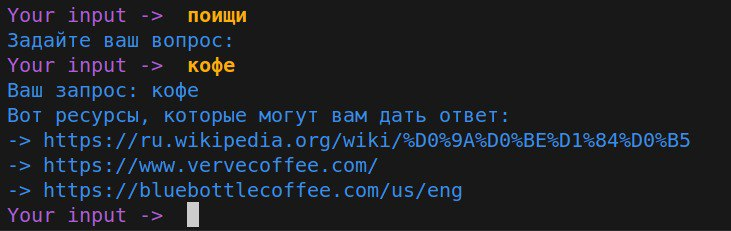
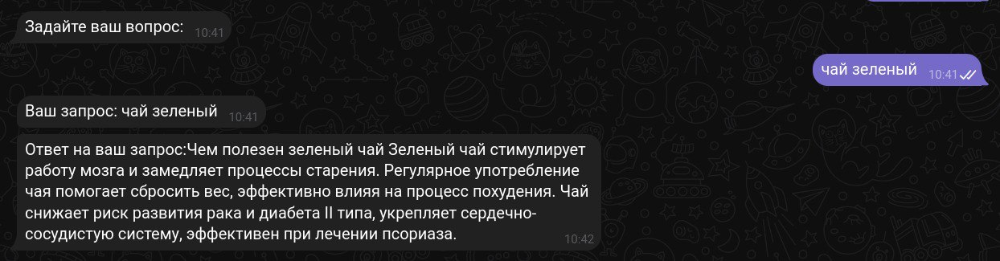

[](https://www.python.org/downloads/release/python-380/)

# Документация "Ассистент РЖД"
__Ассистент РЖД__ - это чатбот, который поможет ответить на интересующие вопросы по теме ПТЭ. Чатбот написан с использованием платформы с открытым исходным кодом RASA.

## Поисковая система

Ассистент поддерживает поиск в интернете. Чтобы попросить бота найти что-то в интернете, необходимо ввести одну из ключевых команд: __"найди"__ или __"поищи"__.

После этого вам будет предложено ввести запрос, бот найдет для вас релевантную информацию по запросу и выдаст вам __текстовый ответ__ или __ссылки на ресурсы__, которые могут вам помочь. 

Поиск происходит с использованием __[Google Custom Search API](https://developers.google.com/custom-search/v1/overview?hl=ru)__ или __[SerpApi](https://serpapi.com/)__. 
### Как происходит поиск?
Сначала запрос принимает SerpApi и возвращает JSON страницы результатов поиска (SERP) Google, после этого если на SERP странице был раздел "Вопросы по теме" (в анг. "People also ask"), то бот выдает ответ на первый вопрос в этом разделе(механизмы google достаточно хорошо справляются и выдают очень релевантные результаты). 

В случае если первая часть поискового механизма не справилась или закончились запросы у SerpApi, поиск происходит с использованием Google Custom Search API, он также возвращает JSON страницы результатов поиска Google. Но в данном случае пользователь получает релевантные ссылки ([Wikipedia](https://en.wikipedia.org/wiki/Main_Page) ставится в первый приоритет). 
## Поддерживаемые платформы
Взаимодействие (общение, диалог, запросы) с ассистентом может происходить на следующих платформах:
- [Telegram](https://web.telegram.org/a/#6581900225)
- [Discord](https://discord.gg/qgB25aZqxZ)
- [VK](https://vk.com/club224708641)

> Для коннекта между мессенжерами и моделью RASA, были использованы Rasa Custom Connectors. 

## Режимы работы
В ходе работы было реализовано два варианта работы с мессенжерами.
1. __Моноканальность__
В этом режиме запросы  отправлялись в один узел входа/выхода на сервере Rasa, и не обрабатывалось с какого канала пришёл запрос, не было асинхронности. Проще говоря начать общение можно было в Телеграме, а закончить в ВК. 

2. __Мультиканальность__
В данном режиме используется несколько узлов входа/выхода, запроосы с разных ресурсов обрабатываются отдельно друг от друга, сервер Rasa знает кто прислал запрос. В данном варианте реалаизации работы, можно настроить так, чтобы ввод был только в одном канале, а вывод в другом, или все в одном канале.

## Установка
1. Склонируйте репозиторий
	```bash
	git clone https://github.com/Dimmension/rasa_rzhd_assistant.git
	```
2. Создание и активация виртуального окружения venv.

	>_Перейдите в корневую директорию перед созданием venv._
	
	__Linux__
	```bash
	python3 -m venv venv
	source ./venv/bin/activate
	```
	__Windows(cmd)__
	```bash
	python -m venv venv
	venv\Scripts\activate.bat
	```
	__Windows(PowerShell)__
	```bash
	python -m venv venv
	venv/Scripts/Activate.ps1
	```
3. Установка зависимостей
	Минимальные пакеты для запуска rasa в режиме shell.
	```bash
	pip install -r rzhd_assistant/rasa_requirements.txt
	```
	
	Пакеты для запуска actions (чтобы работала функция поиска). 
	```bash
	pip install -r rzhd_assistant/rasa_actions_requirements.txt
	```

	Пакеты для запуска rasa в режиме run (необходимо для запуска connector'ов мессенжеров).
	```bash
	pip install -r rzhd_assistant/rasa_connectors_requirements.txt
	```

## Ngrok

__Настройка ngrok__

Установить ngrok по [___инструкции___](https://ngrok.com/docs/getting-started/).
Далее нужно зарегистрироваться на сайте [__ngrok__](https://dashboard.ngrok.com/login) и получить токен [__тут__](https://dashboard.ngrok.com/get-started/your-authtoken), выполнить команду ниже или готовую команду на сайте.
```bash
ngrok config add-authtoken <TOKEN>
```
Необходимо создать [__статический домен__](https://dashboard.ngrok.com/cloud-edge/domains).
_Пример:_
```
crucial-boar-strangely.ngrok-free.app
```
Далее запуситить ngrok на своем компютере с портом 5005.
```bash
ngrok http --domain=<YOUR_STATIC_DOMAIN> 5005
```

> __ДЛЯ РАБОТЫ В _МОНОКАНАЛЬНОМ_ РЕЖИМЕ NGROK НЕ НУЖЕН__ 

## __Токены__

1. __Поисковая система__

	__SerpApi__

	Необходимо получить токен SerpApi [__здесь__](https://serpapi.com/manage-api-key)

	__Custom Search API__

	a) Шаги получения __API key__:

	1. Зайдите [сюда](https://console.cloud.google.com/) 

	2. Cоздайте New Project

	3. Перейдите по [ссылке](https://console.cloud.google.com/)

	4. APIs & Services 

	5. Добавьте Custom Search API (Enable APIs and Servies)

	5. Credentials

	6. Create Credentials

	7. Show Key

	b) Шаги получения __Search Engine ID__

	1. Зайдите [сюда](https://programmablesearchengine.google.com/controlpanel/all)

	2. Добавьте поисковую систему(при создании выбрать "__Поиск во всем интернете__"!)

	3. Настроить

	4. Идентификатор поисковой системы

2. __Мессенджеры:__

	Потребуется получить токены в той среде взаимодействия в которой вы хотите, чтобы он использовался, а потом вписать их в __credentials.yml__:

	__Telegram__

	_Инструкция получения данных для телеграма: https://core.telegram.org/bots/tutorial#getting-ready_


	__VK__

	_Инструкция получения данных для ВК: https://dev.vk.com/ru/api/callback/getting-started_

	Шаги получения токена VK и настройки API:
	1. Создать сообщество
	2. Включить сообщения сообщества (Управление -> Сообщения -> Сообщения сообщества)
	3. Создать токен (Управление -> Настройки -> Работа с API -> Ключи доступа -> Создать ключ (выбрать все пункты))
	4. Выбрать типы событий Callback (Callback API -> Типы событий -> Входящие сообщения)
	5. Включить Long Poll API (Long Poll API -> Настройки -> Включено)
	6. Выбрать типы событий LongPoll (Long Poll API -> Типы событий -> Входящие сообщения)
	7. Получить secret key (Callback API -> Настройки сервера -> Строка, которую должен вернуть сервер: <ТУТ ВАШ secret key>)
	8. Вставить URL с ngrok доменом (Адрес -> https://<ДОМЕН NGROK>/webhooks/vk/webhook) 

	__Discord__
	
	Шаги получения токена Discord и настройки бота:
	1. Перейдите на [портал разработков Discord](https://discord.com/developers/applications)
	2. Discord токен:
		Applications -> Bot -> часть Build-A-Bot -> Token
	4. 	Добавить сервер в Discord:
			Discord -> плюс (Добавить сервер) -> Свой шаблон -> выбрать любое -> задать название
	3. Discord URL-ссылка:
		OAuth2 -> OAuth2 URL Generator -> Scopes (Выбрать bot)
					       -> Bot Permissions (Administrator)	
		Перейти по ссылке Generated URL -> Добавить на сервер -> Выбрать добавленный Discord-сервер
	
	> __!! Для общения с ботом нужно перейти в личные сообщения с ним (Профиль бота - Отправить сообщение) !!__
## Настройка переменных окружения и credentials
В директориях __bots__ и __actions__ надо создать __.env__ файлы со следующим содержанием.

___.env (actions)___
```python
SERP_API_KEY = "<YOUR_TOKEN>"				# 0aff6c85610e01cf474c8606304bcacd8a664dbaf00dea34d8bea0c51dce000a

GOOGLE_API_KEY = "<YOUR_TOKEN>"				# AIaaSyDtjcB-rbY3emMy9ctnoW99sRPPEXUD1uc
GOOGLE_SEARCH_ENGINE_ID = "<YOUR_TOKEN>"	# e2019b57168b54430

URL_SERPAPI_STATS_PAGE = "https://serpapi.com/account?api_key="
URL_GOOGLE_SEARCH = "https://customsearch.googleapis.com/customsearch/v1"
```

___.env (bots)___
```python
TELEGRAM_TOKEN = "<YOUR_TOKEN>" # 0019292000:AAGzgVeioeDWhSFwoeQLt3ZvMhgqd88RVHc
VK_TOKEN = "<YOUR_TOKEN>" 		# vk1.a.cjKmtkTYN6kdEYKq3_EbMgAWducR...149gamSUJcI7-6v7Af6DYgLLwzqmjYSbABk7PmfVEf7oxx_gA-nelwXilQ
DISCORD_TOKEN = "<YOUR_TOKEN>" 	# MTIwNzY1MDk3NjAyMzE5MzQ0Mw.GbqbZC.u7zCrNzvoGC8zTs3QqWLUrY_YTGo8tJlEICZb4
```

В файл __credentials.yml__ необходимо добавить полученные токены:

```yml
### credentials.yml
connectors.telegram.TelegramInput:
access_token: 'YOUR_TOKEN'
verify: 'BOT_USERNAME'
webhook_url: 'https://<YOUR_STATIC_DOMAIN>/webhooks/telegram/webhook'
```

```yml
### credentials.yml
connectors.vk.VkInput:
access_token: 'YOUR_TOKEN'
secret_key: 'SECRET_KEY'
webhook_url: 'https://<YOUR_STATIC_DOMAIN>/webhooks/vk/webhook'
```


## Запуск

Перед запуском необходимо обучить модель, если она отсутствует в директории __models__.

```bash
rasa train # Обучение модели rasa
```
#### Запуск в разных режимах работы
1. В режиме консоли:
	```bash
	rasa shell # Запуск модели rasa
	```
	```bash
	rasa run actions # Запуск custom actions
	```
2. С использованием мессенджеров(Мультиканальность)
		
	```bash
	rasa run --enable-api # Запуск модели 
	```
	```bash
	rasa run actions # Запуск custom actions
	```
3. С использованием мессенджеров(Моноканальность)
		
	```bash
	rasa run --enable-api # Запуск модели 
	```
	```bash
	rasa run actions # Запуск custom actions
	```


    Нужно создать еще один venv для запуска ботов, по причине того что есть конфликты библиотек
	
	3.1 Перейите в директорию с ботами
    ```bash
	cd bots
	```
	3.2 Создайте окружение и активируйте(не забудьте выйти из прошлого "deactivate")
	```bash
    python3 -m venv venv
    source ./venv/bin/activate
    ```
	3.3 Установите зависимости
    ```bash
    pip install -r bots_requirements.txt
    ```
	3.4 Запустите всех ботов
    ```bash
    python3 telegram_api_bot.py
    python3 vk_api_bot.py
    python3 discord_api_bot.py
    ```
## Docker

```docker
docker-compose up
```

Если нет docker images запускать с аргументом --build
```docker
docker-compose up --build
```

В случае, если поднимаем docker-compose, файл endpoints.yml нужно изменить:
```yml
### endpoints.yml
action_endpoint:
 url: "http://action-server:5055/webhook"
```
В случае, если запускаем без docker, файл endpoints.yml не изменяем:
```yml
### endpoints.yml
action_endpoint:
 url: "http://localhost:5055/webhook"
```

## Пример работы

